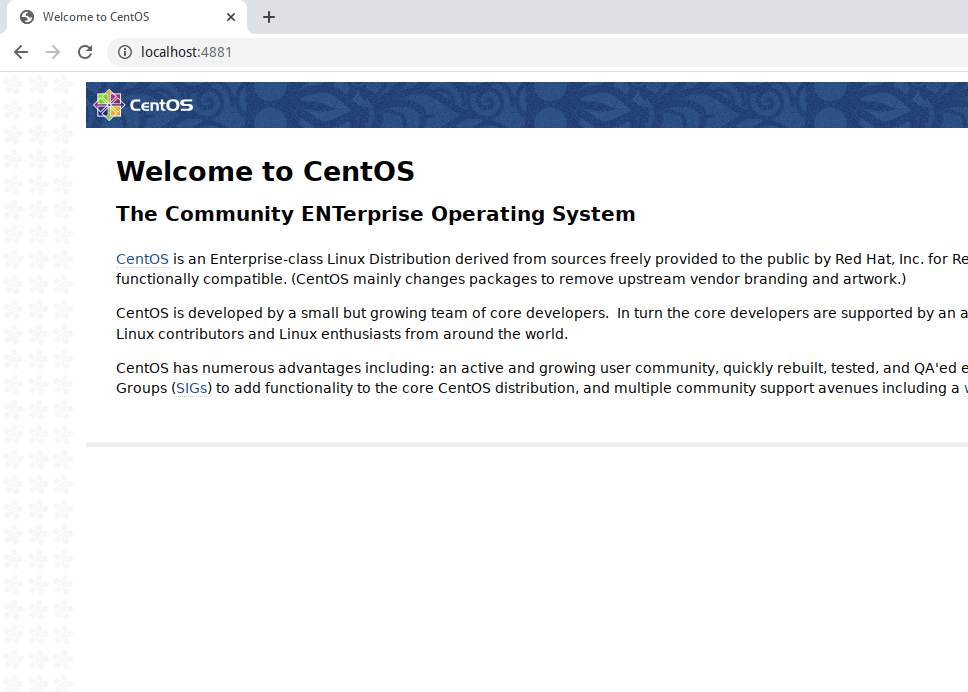

# Домашнее задание: Практика с SELinux

Что нужно сделать?

Запустить nginx на нестандартном порту 3-мя разными способами:
- переключатели setsebool;
- добавление нестандартного порта в имеющийся тип;
- формирование и установка модуля SELinux.

## Решение:

Проверка показала, что файрвол отключен, конфигурация nginx не содежит ошибок, а SELinux включен:
```bash
[root@selinux ~]# systemctl status firewalld
● firewalld.service - firewalld - dynamic firewall daemon
   Loaded: loaded (/usr/lib/systemd/system/firewalld.service; disabled; vendor preset: enabled)
   Active: inactive (dead)
     Docs: man:firewalld(1)
[root@selinux ~]# nginx -t
nginx: the configuration file /etc/nginx/nginx.conf syntax is ok
nginx: configuration file /etc/nginx/nginx.conf test is successful
[root@selinux ~]# getenforce
Enforcing
```

### 1. Разрешим в SELinux работу nginx на порту TCP 4881 c помощью переключателей setsebool

Находим в логе запись о блокировнии порта 4881

```bash
[root@selinux ~]# cat /var/log/audit/audit.log | grep 4881
type=AVC msg=audit(1713298087.070:866): avc:  denied  { name_bind } for  pid=3002 comm="nginx" src=4881 scontext=system_u:system_r:httpd_t:s0 tcontext=system_u:object_r:unreserved_port_t:s0 tclass=tcp_socket permissive=0
```

Узнаём с помощью audit2why причину блокировки и что надо поменять для исправления:
```bash

[root@selinux ~]# grep 1713298087.070:866 /var/log/audit/audit.log | audit2why
type=AVC msg=audit(1713298087.070:866): avc:  denied  { name_bind } for  pid=3002 comm="nginx" src=4881 scontext=system_u:system_r:httpd_t:s0 tcontext=system_u:object_r:unreserved_port_t:s0 tclass=tcp_socket permissive=0

        Was caused by:
        The boolean nis_enabled was set incorrectly. 
        Description:
        Allow nis to enabled

        Allow access by executing:
        # setsebool -P nis_enabled 1
```

Делаем то, что говорит audit2why и проверяем результат:

```bash
[root@selinux ~]# setsebool -P nis_enabled on
[root@selinux ~]# systemctl restart nginx
[root@selinux ~]# systemctl status nginx
● nginx.service - The nginx HTTP and reverse proxy server
   Loaded: loaded (/usr/lib/systemd/system/nginx.service; disabled; vendor preset: disabled)
   Active: active (running) since Tue 2024-04-16 20:30:52 UTC; 4s ago
  Process: 14164 ExecStart=/usr/sbin/nginx (code=exited, status=0/SUCCESS)
  Process: 14161 ExecStartPre=/usr/sbin/nginx -t (code=exited, status=0/SUCCESS)
  Process: 14160 ExecStartPre=/usr/bin/rm -f /run/nginx.pid (code=exited, status=0/SUCCESS)
 Main PID: 14166 (nginx)
   CGroup: /system.slice/nginx.service
           ├─14166 nginx: master process /usr/sbin/nginx
           └─14168 nginx: worker process

Apr 16 20:30:52 selinux systemd[1]: Starting The nginx HTTP and reverse proxy server...
Apr 16 20:30:52 selinux nginx[14161]: nginx: the configuration file /etc/nginx/nginx.conf syntax is ok
Apr 16 20:30:52 selinux nginx[14161]: nginx: configuration file /etc/nginx/nginx.conf test is successful
Apr 16 20:30:52 selinux systemd[1]: Started The nginx HTTP and reverse proxy server.
```
Результат в браузере:


Проверяем установленный параметр, отключаем его, перезапускаем Nginx и убеждаемся, что он не работает:
```bash
[root@selinux ~]# getsebool -a | grep nis_enabled
nis_enabled --> on
[root@selinux ~]# setsebool -P nis_enabled off
[root@selinux ~]# systemctl restart nginx
Job for nginx.service failed because the control process exited with error code. See "systemctl status nginx.service" and "journalctl -xe" for details.
[root@selinux ~]# systemctl status nginx
● nginx.service - The nginx HTTP and reverse proxy server
   Loaded: loaded (/usr/lib/systemd/system/nginx.service; disabled; vendor preset: disabled)
   Active: failed (Result: exit-code) since Tue 2024-04-16 20:35:12 UTC; 2s ago
  Process: 14164 ExecStart=/usr/sbin/nginx (code=exited, status=0/SUCCESS)
  Process: 14188 ExecStartPre=/usr/sbin/nginx -t (code=exited, status=1/FAILURE)
  Process: 14187 ExecStartPre=/usr/bin/rm -f /run/nginx.pid (code=exited, status=0/SUCCESS)
 Main PID: 14166 (code=exited, status=0/SUCCESS)

Apr 16 20:35:12 selinux systemd[1]: Stopped The nginx HTTP and reverse proxy server.
Apr 16 20:35:12 selinux systemd[1]: Starting The nginx HTTP and reverse proxy server...
Apr 16 20:35:12 selinux nginx[14188]: nginx: the configuration file /etc/nginx/nginx.conf syntax is ok
Apr 16 20:35:12 selinux nginx[14188]: nginx: [emerg] bind() to 0.0.0.0:4881 failed (13: Permission denied)
Apr 16 20:35:12 selinux nginx[14188]: nginx: configuration file /etc/nginx/nginx.conf test failed
Apr 16 20:35:12 selinux systemd[1]: nginx.service: control process exited, code=exited status=1
Apr 16 20:35:12 selinux systemd[1]: Failed to start The nginx HTTP and reverse proxy server.
Apr 16 20:35:12 selinux systemd[1]: Unit nginx.service entered failed state.
Apr 16 20:35:12 selinux systemd[1]: nginx.service failed.
[root@selinux ~]# 
```

### 2. Разрешим в SELinux работу nginx на порту TCP 4881 c помощью добавления нестандартного порта в имеющийся тип.

Находим сущестующий тип для http трафика:
```bash
[root@selinux ~]# semanage port -l | grep http
http_cache_port_t              tcp      8080, 8118, 8123, 10001-10010
http_cache_port_t              udp      3130
http_port_t                    tcp      80, 81, 443, 488, 8008, 8009, 8443, 9000
pegasus_http_port_t            tcp      5988
pegasus_https_port_t           tcp      5989
```

Видим, что нужно добавить порт 4881 в тип `http_port_t`. Добавляем порт, перезапускаем nginx и проверяем его статус:
```bash
[root@selinux ~]# semanage port -a -t http_port_t -p tcp 4881
[root@selinux ~]# systemctl restart nginx
[root@selinux ~]# systemctl status nginx
● nginx.service - The nginx HTTP and reverse proxy server
   Loaded: loaded (/usr/lib/systemd/system/nginx.service; disabled; vendor preset: disabled)
   Active: active (running) since Tue 2024-04-16 20:40:23 UTC; 11s ago
  Process: 14211 ExecStart=/usr/sbin/nginx (code=exited, status=0/SUCCESS)
  Process: 14209 ExecStartPre=/usr/sbin/nginx -t (code=exited, status=0/SUCCESS)
  Process: 14208 ExecStartPre=/usr/bin/rm -f /run/nginx.pid (code=exited, status=0/SUCCESS)
 Main PID: 14213 (nginx)
   CGroup: /system.slice/nginx.service
           ├─14213 nginx: master process /usr/sbin/nginx
           └─14215 nginx: worker process

Apr 16 20:40:23 selinux systemd[1]: Starting The nginx HTTP and reverse proxy server...
Apr 16 20:40:23 selinux nginx[14209]: nginx: the configuration file /etc/nginx/nginx.conf syntax is ok
Apr 16 20:40:23 selinux nginx[14209]: nginx: configuration file /etc/nginx/nginx.conf test is successful
Apr 16 20:40:23 selinux systemd[1]: Started The nginx HTTP and reverse proxy server.
```

Теперь удаляем порт 4881 из типа, снова перезапускаем Nginx и проверяем результат:
[root@selinux ~]# semanage port -d -t http_port_t -p tcp 4881
[root@selinux ~]# systemctl restart nginx
Job for nginx.service failed because the control process exited with error code. See "systemctl status nginx.service" and "journalctl -xe" for details.
[root@selinux ~]# systemctl status nginx
● nginx.service - The nginx HTTP and reverse proxy server
   Loaded: loaded (/usr/lib/systemd/system/nginx.service; disabled; vendor preset: disabled)
   Active: failed (Result: exit-code) since Tue 2024-04-16 20:42:16 UTC; 2s ago
  Process: 14211 ExecStart=/usr/sbin/nginx (code=exited, status=0/SUCCESS)
  Process: 14232 ExecStartPre=/usr/sbin/nginx -t (code=exited, status=1/FAILURE)
  Process: 14231 ExecStartPre=/usr/bin/rm -f /run/nginx.pid (code=exited, status=0/SUCCESS)
 Main PID: 14213 (code=exited, status=0/SUCCESS)

Apr 16 20:42:16 selinux systemd[1]: Stopped The nginx HTTP and reverse proxy server.
Apr 16 20:42:16 selinux systemd[1]: Starting The nginx HTTP and reverse proxy server...
Apr 16 20:42:16 selinux nginx[14232]: nginx: the configuration file /etc/nginx/nginx.conf syntax is ok
Apr 16 20:42:16 selinux nginx[14232]: nginx: [emerg] bind() to 0.0.0.0:4881 failed (13: Permission denied)
Apr 16 20:42:16 selinux nginx[14232]: nginx: configuration file /etc/nginx/nginx.conf test failed
Apr 16 20:42:16 selinux systemd[1]: nginx.service: control process exited, code=exited status=1
Apr 16 20:42:16 selinux systemd[1]: Failed to start The nginx HTTP and reverse proxy server.
Apr 16 20:42:16 selinux systemd[1]: Unit nginx.service entered failed state.
Apr 16 20:42:16 selinux systemd[1]: nginx.service failed.

### 3. Разрешим в SELinux работу nginx на порту TCP 4881 c помощью формирования и установки модуля SELinux.

Ищем в логах `nginx` и передаём результат утилите `audit2allow` чтобы получить модуль, разрешающий работу nginx на порту 4881, потом включаем этот модуль:

```bash
[root@selinux ~]# grep nginx /var/log/audit/audit.log | audit2allow -M nginx
******************** IMPORTANT ***********************
To make this policy package active, execute:

semodule -i nginx.pp

[root@selinux ~]# semodule -i nginx.pp
[root@selinux ~]# systemctl start nginx
[root@selinux ~]# systemctl status nginx
● nginx.service - The nginx HTTP and reverse proxy server
   Loaded: loaded (/usr/lib/systemd/system/nginx.service; disabled; vendor preset: disabled)
   Active: active (running) since Tue 2024-04-16 20:48:25 UTC; 8s ago
  Process: 14260 ExecStart=/usr/sbin/nginx (code=exited, status=0/SUCCESS)
  Process: 14258 ExecStartPre=/usr/sbin/nginx -t (code=exited, status=0/SUCCESS)
  Process: 14257 ExecStartPre=/usr/bin/rm -f /run/nginx.pid (code=exited, status=0/SUCCESS)
 Main PID: 14262 (nginx)
   CGroup: /system.slice/nginx.service
           ├─14262 nginx: master process /usr/sbin/nginx
           └─14264 nginx: worker process

Apr 16 20:48:25 selinux systemd[1]: Starting The nginx HTTP and reverse proxy server...
Apr 16 20:48:25 selinux nginx[14258]: nginx: the configuration file /etc/nginx/nginx.conf syntax is ok
Apr 16 20:48:25 selinux nginx[14258]: nginx: configuration file /etc/nginx/nginx.conf test is successful
Apr 16 20:48:25 selinux systemd[1]: Started The nginx HTTP and reverse proxy server.
```

## Обеспечение работоспособности приложения при включенном SELinux

Запускаем стенд и проверяем его работоспособность.
```bash
[andrej@home-srv selinux_dns_problems]$ vagrant status 
Current machine states:

ns01                      running (virtualbox)
client                    running (virtualbox)

This environment represents multiple VMs. The VMs are all listed
above with their current state. For more information about a specific
VM, run `vagrant status NAME`.

```

Подключаемся к клиенту и пробуем внести изенения в зону, после неудачи проверяем логи с помощью audit2why, результат - отсутствие ошибок на клиенте.
```bash
[andrej@home-srv selinux_dns_problems]$ vagrant ssh client
Last login: Tue Apr 16 20:59:57 2024 from 10.0.2.2
###############################
### Welcome to the DNS lab! ###
###############################

- Use this client to test the enviroment
- with dig or nslookup. Ex:
    dig @192.168.50.10 ns01.dns.lab

- nsupdate is available in the ddns.lab zone. Ex:
    nsupdate -k /etc/named.zonetransfer.key
    server 192.168.50.10
    zone ddns.lab 
    update add www.ddns.lab. 60 A 192.168.50.15
    send

- rndc is also available to manage the servers
    rndc -c ~/rndc.conf reload

###############################
### Enjoy! ####################
###############################
[vagrant@client ~]$ nsupdate -k /etc/named.zonetransfer.key
> 
> ^C[vagrant@client ~]$ nsupdate -k /etc/named.zonetransfer.key
> server 192.168.50.10
> zone ddns.lab
> update add www.ddns.lab
could not read owner ttl
> update add www.ddns,lab 60 A 192.168.50.15
check-names failed: bad owner 'www.ddns,lab'
> update add www.ddns.lab. 60 A 192.168.50.15
> send
update failed: SERVFAIL
> quit
[vagrant@client ~]$ sudo -i
[root@client ~]# cat /var/log/audit/audit.log | audit2why
[root@client ~]#  
```

Подключаемся к серверу и выполняем аудит лога на нём:
```bash
[andrej@home-srv selinux_dns_problems]$ vagrant ssh ns01
Last login: Tue Apr 16 20:56:54 2024 from 10.0.2.2
[vagrant@ns01 ~]$ sudo -i 
[root@ns01 ~]# cat /var/log/audit/audit.log | audit2why
type=AVC msg=audit(1713301501.396:1954): avc:  denied  { create } for  pid=5290 comm="isc-worker0000" name="named.ddns.lab.view1.jnl" scontext=system_u:system_r:named_t:s0 tcontext=system_u:object_r:etc_t:s0 tclass=file permissive=0

        Was caused by:
                Missing type enforcement (TE) allow rule.

                You can use audit2allow to generate a loadable module to allow this access.

[root@ns01 ~]# ls -laZ /etc/named
drw-rwx---. root named system_u:object_r:etc_t:s0       .
drwxr-xr-x. root root  system_u:object_r:etc_t:s0       ..
drw-rwx---. root named unconfined_u:object_r:etc_t:s0   dynamic
-rw-rw----. root named system_u:object_r:etc_t:s0       named.50.168.192.rev
-rw-rw----. root named system_u:object_r:etc_t:s0       named.dns.lab
-rw-rw----. root named system_u:object_r:etc_t:s0       named.dns.lab.view1
-rw-rw----. root named system_u:object_r:etc_t:s0       named.newdns.lab
```

Смотрим, где должны лежать конфигурационные файлы:
```bash
[root@ns01 ~]# semanage fcontext -l | grep named
/etc/rndc.*                                        regular file       system_u:object_r:named_conf_t:s0 
/var/named(/.*)?                                   all files          system_u:object_r:named_zone_t:s0 
/etc/unbound(/.*)?                                 all files          system_u:object_r:named_conf_t:s0 
/var/run/bind(/.*)?                                all files          system_u:object_r:named_var_run_t:s0 
/var/log/named.*                                   regular file       system_u:object_r:named_log_t:s0 
/var/run/named(/.*)?                               all files          system_u:object_r:named_var_run_t:s0 
/var/named/data(/.*)?                              all files          system_u:object_r:named_cache_t:s0 
/dev/xen/tapctrl.*                                 named pipe         system_u:object_r:xenctl_t:s0 
/var/run/unbound(/.*)?                             all files          system_u:object_r:named_var_run_t:s0 
/var/lib/softhsm(/.*)?                             all files          system_u:object_r:named_cache_t:s0 
/var/lib/unbound(/.*)?                             all files          system_u:object_r:named_cache_t:s0 
/var/named/slaves(/.*)?                            all files          system_u:object_r:named_cache_t:s0 
/var/named/chroot(/.*)?                            all files          system_u:object_r:named_conf_t:s0 
/etc/named\.rfc1912.zones                          regular file       system_u:object_r:named_conf_t:s0 
/var/named/dynamic(/.*)?                           all files          system_u:object_r:named_cache_t:s0 
/var/named/chroot/etc(/.*)?                        all files          system_u:object_r:etc_t:s0 
/var/named/chroot/lib(/.*)?                        all files          system_u:object_r:lib_t:s0 
/var/named/chroot/proc(/.*)?                       all files          <<None>>
/var/named/chroot/var/tmp(/.*)?                    all files          system_u:object_r:named_cache_t:s0 
/var/named/chroot/usr/lib(/.*)?                    all files          system_u:object_r:lib_t:s0 
/var/named/chroot/etc/pki(/.*)?                    all files          system_u:object_r:cert_t:s0 
/var/named/chroot/run/named.*                      all files          system_u:object_r:named_var_run_t:s0 
/var/named/chroot/var/named(/.*)?                  all files          system_u:object_r:named_zone_t:s0 
/usr/lib/systemd/system/named.*                    regular file       system_u:object_r:named_unit_file_t:s0 
/var/named/chroot/var/run/dbus(/.*)?               all files          system_u:object_r:system_dbusd_var_run_t:s0 
/usr/lib/systemd/system/unbound.*                  regular file       system_u:object_r:named_unit_file_t:s0 
/var/named/chroot/var/log/named.*                  regular file       system_u:object_r:named_log_t:s0 
/var/named/chroot/var/run/named.*                  all files          system_u:object_r:named_var_run_t:s0 
/var/named/chroot/var/named/data(/.*)?             all files          system_u:object_r:named_cache_t:s0 
/usr/lib/systemd/system/named-sdb.*                regular file       system_u:object_r:named_unit_file_t:s0 
/var/named/chroot/var/named/slaves(/.*)?           all files          system_u:object_r:named_cache_t:s0 
/var/named/chroot/etc/named\.rfc1912.zones         regular file       system_u:object_r:named_conf_t:s0 
/var/named/chroot/var/named/dynamic(/.*)?          all files          system_u:object_r:named_cache_t:s0 
/var/run/ndc                                       socket             system_u:object_r:named_var_run_t:s0 
/dev/gpmdata                                       named pipe         system_u:object_r:gpmctl_t:s0 
/dev/initctl                                       named pipe         system_u:object_r:initctl_t:s0 
/dev/xconsole                                      named pipe         system_u:object_r:xconsole_device_t:s0 
/usr/sbin/named                                    regular file       system_u:object_r:named_exec_t:s0 
/etc/named\.conf                                   regular file       system_u:object_r:named_conf_t:s0 
/usr/sbin/lwresd                                   regular file       system_u:object_r:named_exec_t:s0 
/var/run/initctl                                   named pipe         system_u:object_r:initctl_t:s0 
/usr/sbin/unbound                                  regular file       system_u:object_r:named_exec_t:s0 
/usr/sbin/named-sdb                                regular file       system_u:object_r:named_exec_t:s0 
/var/named/named\.ca                               regular file       system_u:object_r:named_conf_t:s0 
/etc/named\.root\.hints                            regular file       system_u:object_r:named_conf_t:s0 
/var/named/chroot/dev                              directory          system_u:object_r:device_t:s0 
/etc/rc\.d/init\.d/named                           regular file       system_u:object_r:named_initrc_exec_t:s0 
/usr/sbin/named-pkcs11                             regular file       system_u:object_r:named_exec_t:s0 
/etc/rc\.d/init\.d/unbound                         regular file       system_u:object_r:named_initrc_exec_t:s0 
/usr/sbin/unbound-anchor                           regular file       system_u:object_r:named_exec_t:s0 
/usr/sbin/named-checkconf                          regular file       system_u:object_r:named_checkconf_exec_t:s0 
/usr/sbin/unbound-control                          regular file       system_u:object_r:named_exec_t:s0 
/var/named/chroot_sdb/dev                          directory          system_u:object_r:device_t:s0 
/var/named/chroot/var/log                          directory          system_u:object_r:var_log_t:s0 
/var/named/chroot/dev/log                          socket             system_u:object_r:devlog_t:s0 
/etc/rc\.d/init\.d/named-sdb                       regular file       system_u:object_r:named_initrc_exec_t:s0 
/var/named/chroot/dev/null                         character device   system_u:object_r:null_device_t:s0 
/var/named/chroot/dev/zero                         character device   system_u:object_r:zero_device_t:s0 
/usr/sbin/unbound-checkconf                        regular file       system_u:object_r:named_exec_t:s0 
/var/named/chroot/dev/random                       character device   system_u:object_r:random_device_t:s0 
/var/run/systemd/initctl/fifo                      named pipe         system_u:object_r:initctl_t:s0 
/var/named/chroot/etc/rndc\.key                    regular file       system_u:object_r:dnssec_t:s0 
/usr/share/munin/plugins/named                     regular file       system_u:object_r:services_munin_plugin_exec_t:s0 
/var/named/chroot_sdb/dev/null                     character device   system_u:object_r:null_device_t:s0 
/var/named/chroot_sdb/dev/zero                     character device   system_u:object_r:zero_device_t:s0 
/var/named/chroot/etc/localtime                    regular file       system_u:object_r:locale_t:s0 
/var/named/chroot/etc/named\.conf                  regular file       system_u:object_r:named_conf_t:s0 
/var/named/chroot_sdb/dev/random                   character device   system_u:object_r:random_device_t:s0 
/etc/named\.caching-nameserver\.conf               regular file       system_u:object_r:named_conf_t:s0 
/usr/lib/systemd/systemd-hostnamed                 regular file       system_u:object_r:systemd_hostnamed_exec_t:s0 
/var/named/chroot/var/named/named\.ca              regular file       system_u:object_r:named_conf_t:s0 
/var/named/chroot/etc/named\.root\.hints           regular file       system_u:object_r:named_conf_t:s0 
/var/named/chroot/etc/named\.caching-nameserver\.conf regular file       system_u:object_r:named_conf_t:s0 
/var/named/chroot/lib64 = /usr/lib
/var/named/chroot/usr/lib64 = /usr/lib
[root@ns01 ~]# 
```

Меняем текст контекста безопасности:
```bash
[root@ns01 ~]# chcon -R -t named_zone_t /etc/named
[root@ns01 ~]# ls -laZ /etc/named
drw-rwx---. root named system_u:object_r:named_zone_t:s0 .
drwxr-xr-x. root root  system_u:object_r:etc_t:s0       ..
drw-rwx---. root named unconfined_u:object_r:named_zone_t:s0 dynamic
-rw-rw----. root named system_u:object_r:named_zone_t:s0 named.50.168.192.rev
-rw-rw----. root named system_u:object_r:named_zone_t:s0 named.dns.lab
-rw-rw----. root named system_u:object_r:named_zone_t:s0 named.dns.lab.view1
-rw-rw----. root named system_u:object_r:named_zone_t:s0 named.newdns.lab
```

На клиенте снова пробуем внести изменения:
```bash
[root@client ~]# nsupdate -k /etc/named.zonetransfer.key
> server 192.168.50.10
> zone ddns.lab
> update add www.ddns.lab. 60 A 192.168.50.15
> send
> quit
[root@client ~]# dig www.ddns.lab

; <<>> DiG 9.11.4-P2-RedHat-9.11.4-26.P2.el7_9.15 <<>> www.ddns.lab
;; global options: +cmd
;; Got answer:
;; ->>HEADER<<- opcode: QUERY, status: NOERROR, id: 32850
;; flags: qr aa rd ra; QUERY: 1, ANSWER: 1, AUTHORITY: 1, ADDITIONAL: 2

;; OPT PSEUDOSECTION:
; EDNS: version: 0, flags:; udp: 4096
;; QUESTION SECTION:
;www.ddns.lab.                  IN      A

;; ANSWER SECTION:
www.ddns.lab.           60      IN      A       192.168.50.15

;; AUTHORITY SECTION:
ddns.lab.               3600    IN      NS      ns01.dns.lab.

;; ADDITIONAL SECTION:
ns01.dns.lab.           3600    IN      A       192.168.50.10

;; Query time: 1 msec
;; SERVER: 192.168.50.10#53(192.168.50.10)
;; WHEN: Tue Apr 16 21:36:41 UTC 2024
;; MSG SIZE  rcvd: 96
```

На этот раз получилось.

Внесены исправления в `playbook.yml`:
```bash
  - name: change context type
    shell: chcon -R -t named_zone_t /etc/named   
```
Работающий стенд представлен в репозитории.

